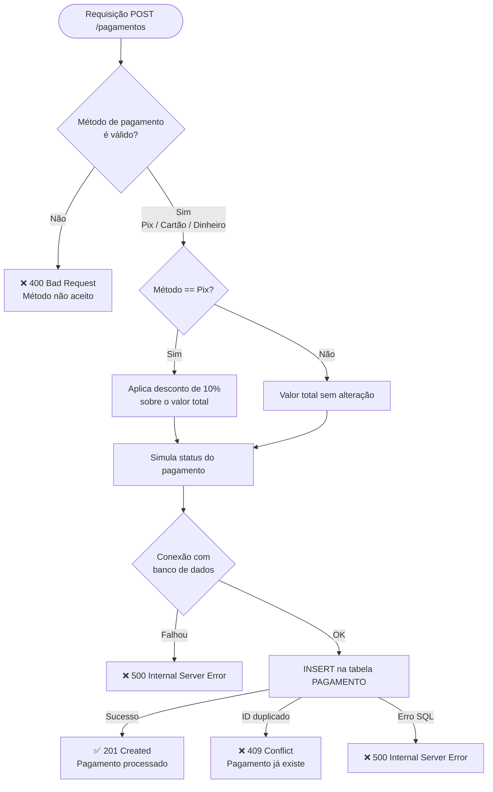
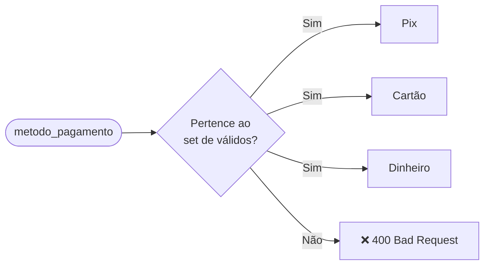
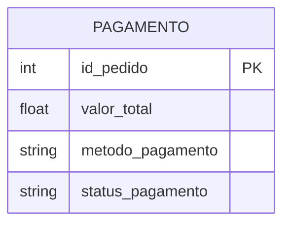

# Sabor Rápido - API de Pagamentos

Serviço REST desenvolvido sob metodologia RAD para processamento de transações financeiras da plataforma **Sabor Rápido**.

---

## Tecnologias

- **Python 3** + **FastAPI**
- **PyMySQL** — conexão com banco de dados MySQL
- **Pydantic** — validação de dados de entrada
- **Uvicorn** — servidor ASGI

---

## Endpoints

| Método | Rota | Descrição |
|--------|------|-----------|
| `GET` | `/` | Status da API |
| `POST` | `/pagamentos` | Registrar e processar um pagamento |
| `GET` | `/pagamentos/{id_pedido}` | Consultar dados de um pagamento existente |

Documentação interativa disponível em: `http://localhost:8000/docs`

---

## Fluxo de Processamento de Pagamento



---

## Regras de Negócio

### Métodos de Pagamento Aceitos



### Incentivo Financeiro — Desconto Pix

Pagamentos realizados via **Pix** recebem automaticamente **10% de desconto** sobre o valor total antes de serem registrados no banco de dados.

```
valor_total = valor_total - (0.10 × valor_total)
```

### Simulação de Status

| Método | Lógica |
|--------|--------|
| `Dinheiro` | Sempre `Aprovado` |
| `Pix` / `Cartão` | 90% `Aprovado` · 10% `Recusado` |

---

## Modelo de Dados



---

## Como Executar

```bash
# Ativar ambiente virtual
.venv\Scripts\Activate.ps1

# Iniciar servidor
uvicorn main:app --reload
```

Acesse: [http://localhost:8000/docs](http://localhost:8000/docs)
